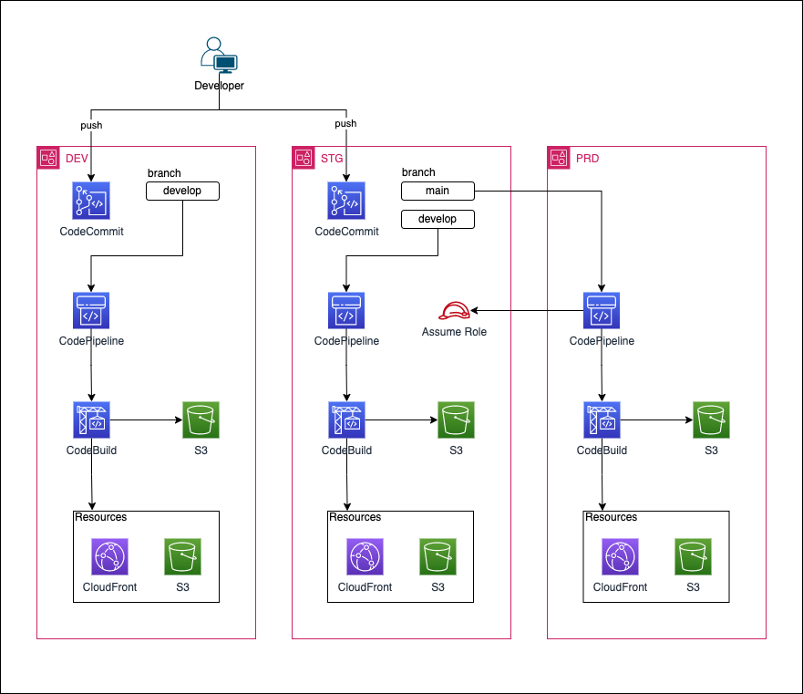

## 事前準備

1. Node.js(10.13.0以降)、npm がインストールされていることを確認。

   ```
   node --version
   npm --version
   ```

2. [AWS CDK CLI](https://aws.amazon.com/jp/getting-started/guides/setup-cdk/module-two/) をインストール。

   ```
   npm install -g aws-cdk
   ```

3. TypeScriptをインストール。

   ```
   npm install -g typescript
   ```

## CDKプロジェクトの構築

1. 任意のディレクトリ配下でCDKプロジェクトを作成。
   ```
   mkdir cdk-demo
   cd cdk-demo
   cdk init --language typescript
   ```

2. 追加モジュールがある場合、以下のコマンドを実行。

   例：kinesisfirehose-destinations-alphaのインストールする場合
   ```
   npm i @aws-cdk/aws-kinesisfirehose-destinations-alpha@2.67.0-alpha.0
   ```


## フォルダ構成

```
cdk_typescript
├── bin
│   └── app.ts    # アプリケーションのエントリポイント
├── cdk.out              # CFn変換後のファイル
├── lib                  # 各種 CDK で記載されたテンプレートファイル
│   └── codecommit_stack.ts
│   ├── fe_pipeline_stack.ts
│   ├── static_hosting_stack.ts
│   └── ・・・
├── front-sample-project # 作成した CodeCommit にプッシュするサンプルプロジェクト
│       ├── build
│       │   ├── dev_buildspec_build.yml     # ビルドプロジェクトを定義するbuildspec
│       │   └── dev_buildspec_clean.yml
│       ├── dist
│       │   └── index.html
│       ├── src
│       │   ├── index.ts
│       │   └── saySomething.ts
├── test                 # jestによるインフラテスト用
│   └── app.test.ts
├── .gitignore
├── .npmignore
├── cdk.json             # CDKの構成ファイル
├── jest.config.js       # jestによるインフラテスト用
├── package.json
├── package-lock.json
├── README.md
└── tsconfig.json        # TypeScriptのコンパイル設定
```
## 作成されるリソースについて

### フロントエンドパイプライン



## 各スタックについて

### CI/CD スタック

- CodePipeline を作成するテンプレート  
   上記で作成されたリポジトリの `develop` ブランチに プッシュ か マージされた場合に実行されます。  

  - `codecommit_stack.ts`
  - `fe_pipeline_stack.ts`
  - `static_hosting_stack.ts`

### Cfn テンプレート生成

```
cdk synth -c attrphase={ STAGE } -c target={ TARGET }
```

- AWS CDK のコードを合成し、 `CloudFormation`テンプレートとして書き出す
- 書き出された CFn テンプレートは `cdk.out `ディレクトリに出力される。

  - この時、引数として以下の２点を指定する
    - attrphase：デプロイ環境 dev, stg, prd の内いずれかを指定（リソースのプレフィックスとなる）
    - target：デプロイするリソースの種類を指定  
      それぞれの引数は以下の通り

  | 引数    | 内容                                       | 主な対象リソース                        |
  | :------ | :----------------------------------------- | :-------------------------------------- |
  | cicd-fe | フロントエンドパイプラインのためのリソース | CodePipeline, CodeBuild, CloudFront, S3 |

### スタックの差分比較

```
cdk diff --profile { プロファイル名 } -c attrphase={ STAGE } -c target={ TARGET }
```

- デプロイされているスタックと、ローカルを比較します
- 対象のアカウントのプロファイルを指定する必要があります

### スタックのデプロイ

```
cdk deploy --profile { プロファイル名 } --require-approval never -c attrphase={ STAGE } -c target={ target } --all
```

- 作成されたスタックをデプロイします。
- `--require-approval never`オプションを指定することで承認確認をスキップできます。
- `--all`オプションは、デプロイ対象スタックが複数ある際に指定します。（単一スタックの場合は指定不要）
